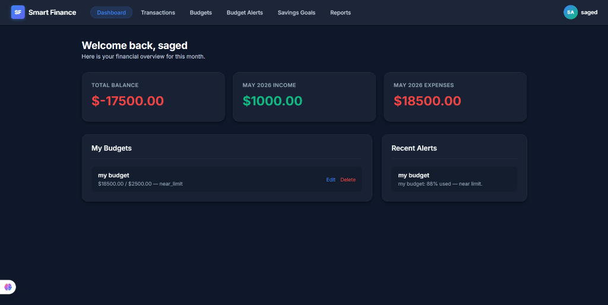

# 💰 Smart Finance


**Smart Finance** is a comprehensive, modern personal finance and budgeting web application built using **Django**. It is designed to help users track their spending, manage monthly budgets, set ambitious savings goals, and stay on top of their financial health with automated real-time alerts.

---



## ✨ Key Features

### 🔐 Secure User Authentication
- Complete user registration, login, and secure session management using Django's built-in authentication system.
- Custom user models tailored to store specific user financial profiles.
- **Premium Profile Page:** A centralized, sleek dashboard for managing user settings and viewing financial summaries.

### 📊 Advanced Budget Tracking
- **Create & Manage Budgets:** Users can define categories, allocate maximum budgets, and track their expenses seamlessly.
- **Dynamic Status Tracking:** Budgets automatically calculate percentages and dynamically update their status (`On Track`, `Near Limit`, `Exceeded`).
- **Automated Alerts:** If a user crosses a defined threshold (e.g., 80% of the allocated budget), the system automatically triggers a **Budget Alert** to notify the user.

### 💸 Income & Expense Management
- **Integrated Transactions:** Record both income and expenses with detailed descriptions and payment methods.
- **Budget Synchronization:** 
    - **Income:** Adding income to a specific budget category automatically increases its total limit.
    - **Expenses:** Recording expenses automatically deducts from the relevant budget's remaining balance.
- **Detailed History:** Track every financial movement with a clean, searchable transaction list.

### 🎯 Smart Savings Goals
- **Goal Setting:** Users can set specific financial targets (e.g., "Buy a Car", "Emergency Fund") with a target deadline.
- **Progress Tracking:** The app calculates live progress percentages and dynamically changes the UI color based on completion (e.g., green for completed, orange for in-progress).
- **Monthly Breakdown:** The system automatically calculates how much a user needs to save per month to reach their goal by the deadline.

### 📈 Financial Dashboard & Reports
- A clean, intuitive, and responsive **Vanilla CSS** frontend providing a premium user experience.
- Overview of all active budgets, active alerts, total allocated amounts, and total spent.

---

## 🎨 UI/UX Design

The visual design and user experience of Smart Finance were meticulously crafted in Figma and implemented with a focus on premium aesthetics.

- **Professional Dark Mode:** A stunning, high-contrast dark theme designed for better readability and a modern feel.
- **Rich Aesthetics:** Implementation of **Glassmorphism**, smooth gradients, and subtle micro-animations for an interactive experience.
- **Responsive Design:** Fully optimized for mobile, tablet, and desktop screens.
- **Figma Files:** You can explore the complete design files here: **[Smart Finance Figma Design](https://www.figma.com/make/qOKDYbZLknZzAzZvMvhyHx/Smart-Finance?p=f&t=RmaGffP568j0J5dS-0&fullscreen=1)**

---

## 🛠️ Technology Stack

| Component | Technology Used |
|-----------|-----------------|
| **Backend Framework** | Django (Python 3.12+) |
| **Database** | SQLite (Production-ready for PostgreSQL) |
| **Frontend** | HTML5, Vanilla CSS, JavaScript |
| **Architecture** | Model-View-Template (MVT) |

---

## 🏗️ Project Structure & Architecture

The application is built using a modular Django architecture, divided into specific functional apps:

- `config/` - Main Django configuration, settings, and root URL routing.
- `users/` - Handles custom user models, authentication flows, and user sessions.
- `budgets/` - Core financial engine managing budget allocations and automated threshold alerts.
- `transactions/` - Manages all financial movements, linking income and expenses to their respective budgets.
- `goals/` - Manages long-term savings goals, calculating required monthly savings and tracking progress.

---

## 🚀 Installation & Setup

Follow these steps to get the project running on your local machine:

**1. Clone the repository:**
```bash
git clone https://github.com/Saged00/Smart-Finance.git
cd Smart-Finance
```

**2. Create and activate a virtual environment:**
```bash
python -m venv venv
# On Windows:
venv\Scripts\activate
# On Mac/Linux:
source venv/bin/activate
```

**3. Install dependencies:**
```bash
pip install django
```

**4. Apply database migrations:**
```bash
python manage.py makemigrations
python manage.py migrate
```

**5. Create a superuser (for admin access):**
```bash
python manage.py createsuperuser
```

**6. Run the development server:**
```bash
python manage.py runserver
```
Navigate to `http://127.0.0.1:8000/` in your browser to access the app!

---

## 💡 Future Enhancements
- [ ] Export financial reports to PDF/Excel.
- [ ] Implement Chart.js for visual spending analytics.
- [ ] Add recurring expenses and subscription tracking.
- [ ] Email notifications for critical budget alerts.

---

## 🔗 Repository Link
You can find the source code here: **[Smart Finance Repository](https://github.com/Saged00/Smart-Finance)**

---

<div align="center">
  <b>Frontend (HTML, CSS, UI/UX) by <a href="https://github.com/Mariam-Mohamedali">Mariam Mohamedali</a></b><br>
  <b>Backend (Django) by <a href="https://github.com/Saged00">Saged</a></b><br>
  <i>Empowering your financial future.</i>
</div>"# Smart-Finance" 
"# Smart-Finance" 
